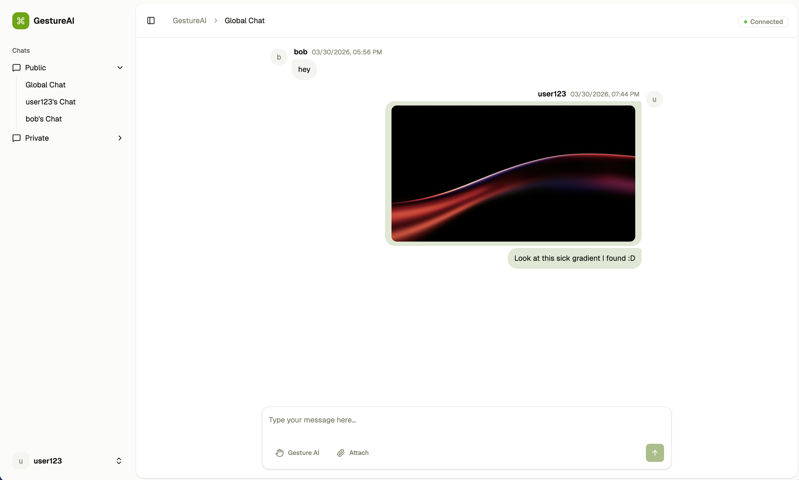
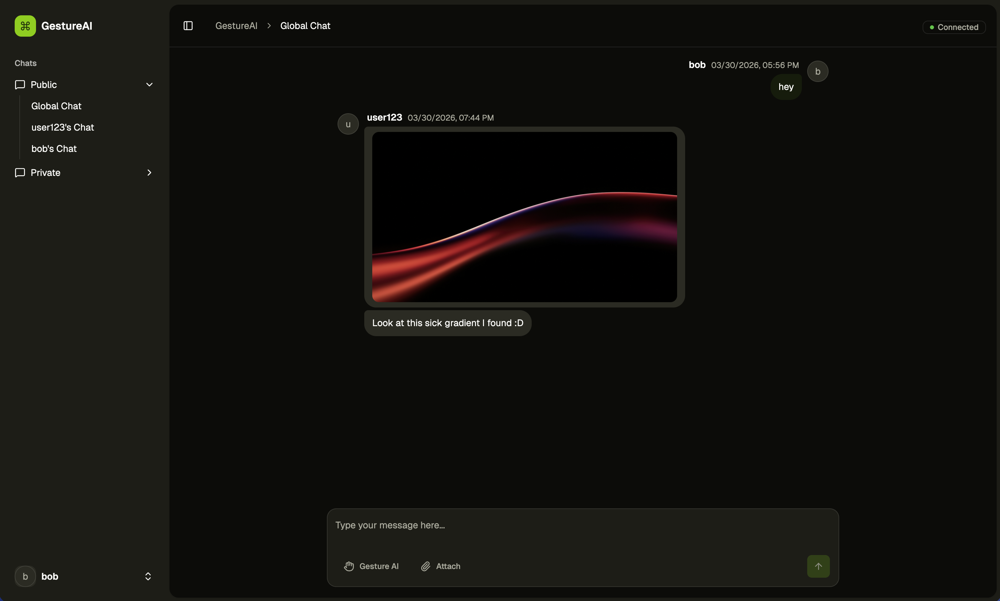
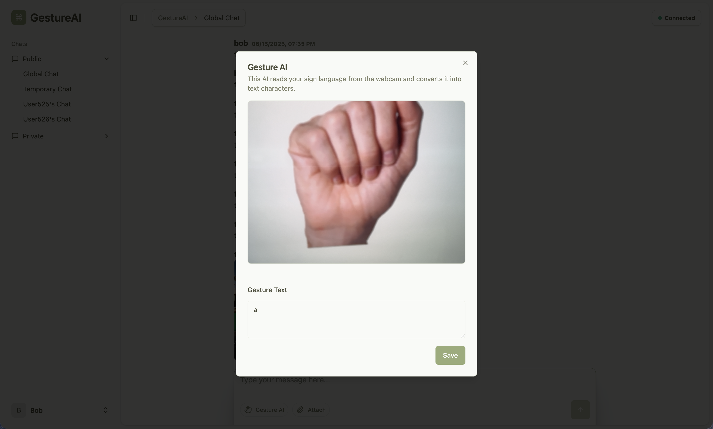

# GestureAI

GestureAI is a real-time chat application that translates American Sign Language (ASL) into text using your webcam. We built it as our final apprenticeship project ("Svenneprøve"). 

While it works as a standard messaging app with text and image sharing, the main draw is the ASL integration. If you toggle the camera on, a custom AI model reads your hand signs and types the corresponding characters directly into your chat input field.

## Screenshots

<div align="center">
  
  
  <br>
  
</div>

## Features

- **ASL Translation:** Turn on your webcam, and the custom AI model translates ASL signs into text characters.
- **Real-time Chat:** Instant messaging powered by WebSockets.
- **Media Uploads:** Share images directly in the chat.
- **Dark/Light Mode:** Full theming support.
- **Dockerized:** The entire stack (frontend, backend, Redis, Postgres) spins up with a single compose file.

## Tech Stack

The app is split into a SvelteKit frontend and a Python backend, tied together with WebSockets and Redis.

- **Frontend (Jesper):** Svelte, SvelteKit, TypeScript, WebSockets, TailwindCSS, shadcn-svelte,
- **Backend (Viktor):** Python (ASL model, API, Analytics page)
- **Infrastructure (Viktor & Jesper):** Docker, Redis, PostgreSQL, Nginx

## Setup

You need Docker and Docker Compose installed. You'll also need to configure the environment variables before starting.

1. **Clone the repository**
   ```bash
   git clone https://github.com/GestureAI/gestureai.git
   cd gestureai
   ```

2. **Set up environment variables**
   Create an `.env` file in the root directory. Based on the `docker-compose.yml`, you'll need to define variables like database credentials (`DB_USER`, `DB_PASS`, `DB_NAME`), your `UPLOADTHING_TOKEN`, and other backend secrets.

3. **Run the containers**
   ```bash
   docker-compose up -d --build
   ```

4. **Access the app**
   Open `http://localhost:5173/` in your browser. Nginx handles the routing automatically.

## Usage

1. Enter a username to join the global chat room.
2. Click the **Gesture AI** badge to enable Gesture Mode and grant webcam permissions.
3. Perform ASL signs clearly in front of the camera, and the recognized characters will appear in your input field.

## License

Distributed under the MIT License. See `LICENSE` for more information.
